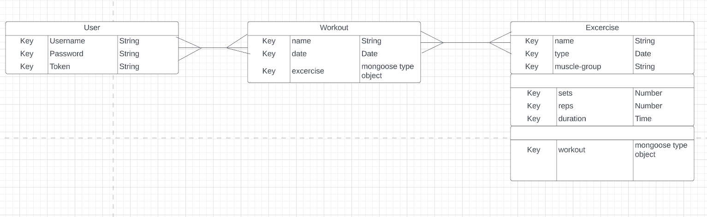

# Workout Tracker

## Description

Track your gains with "My Fit", your very own customizable fitness tracker that let's you store, add, edit, or even delete your workouts. Finally! It's just like having your very own personal trainer, but on your desktop or mobile device. 

## How to run

Will fill in later

## Wire Frames

### Sign In 

### Sign Up 

### User Homepage

### Workout Planner 

## ERD :

### Models: User, Workout, Excercise

## User Stories

### MVP

As a user I want to....

1. Login to account
    - Create a database to store collections. Create a user model with validation/authentication methods. If user fields pass validation, grant access to site
2. See Account info
    - On validation, user will see their current workouts (if existant), option to create workout, and option to see excercise list
3. Select option to start new workout-plan
    - A new workout model will be created for each newly created workout
    - Each workout will contain an excercise model with a many to many relationship. Each workout-plan can have many excercises and each excercise can, and will, 
        be associated with many workout-plans
    - Form fields to add excercise type, excercise name, reps, sets, duration, date
    - Option to edit, delete, and create new workout-plan
    - Post newly created fields to the page and save to database for user's account
5. Select option to see all workout-plans
    - See user's previous workouts
        Database to store collection called 'workouts' that on submit, are stored to the collection associated with the user's account
    - Options to edit, delete, or create new workouts
    - Workouts populate on user's screen on page load after authentication
6. Option to login, create a new account, see workouts, excercises, and excercise list at top

 
## Technologies Used
- Mongoose
- MongoDB
- Express
- Node.js
- JavaScript
- HTML
- CSS

### Ver.2

- See workout library
    - Drop down list of excersices separated by category: strength-training, cardio, etc.
- User profile picture

### Ver.3
- Api inclusion
- Description of each excercise
- Search bar the uses api to find the excercise that is typed in# Workout-Tracker
# Workout-Tracker---Client
