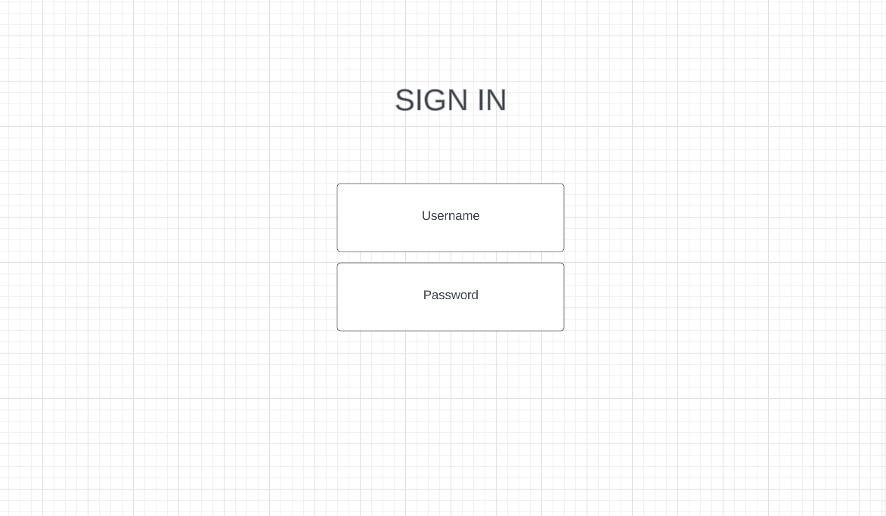
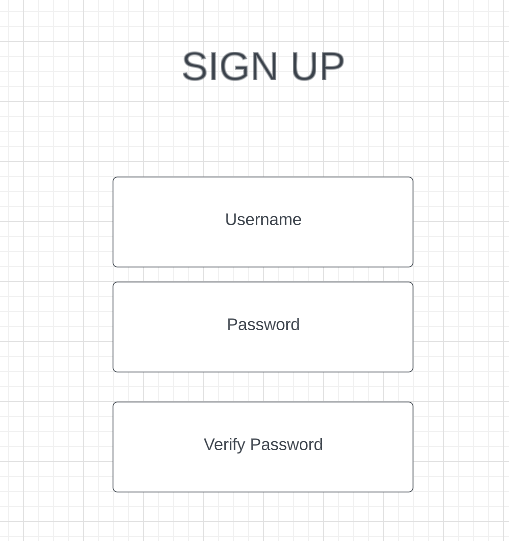
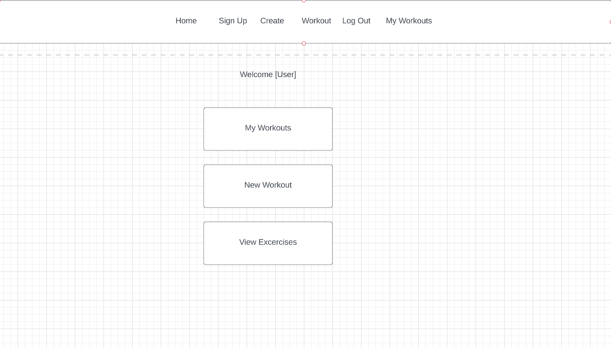
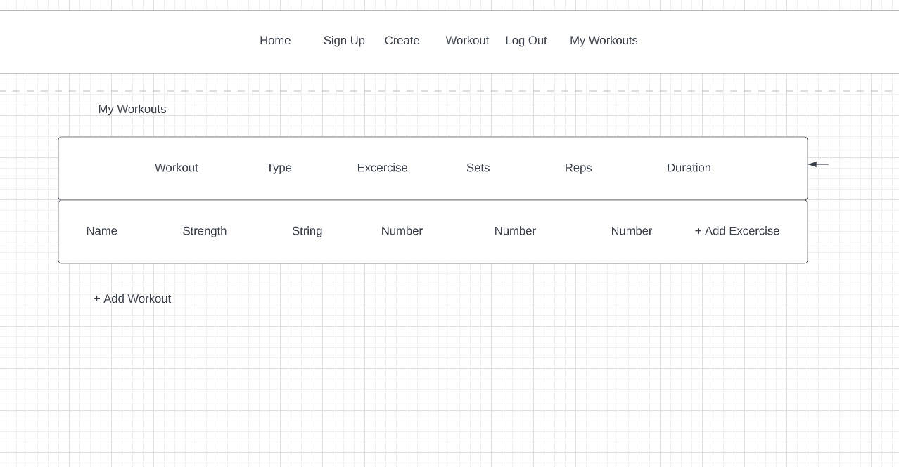
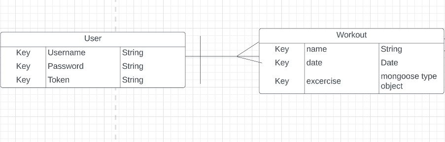
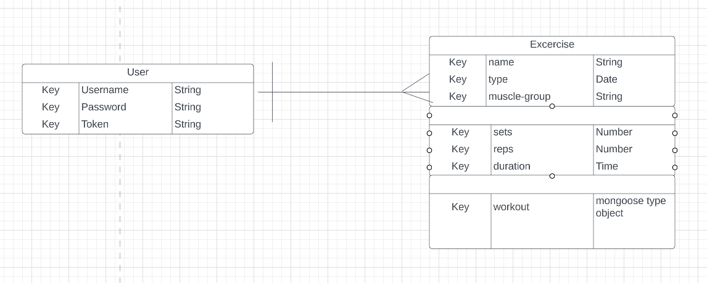

# Workout-Tracker---Client

## Description

Track your gains with "My Fit", your very own customizable fitness tracker that let's you store, add, edit, or even delete your workouts. Finally! It's just like having your very own personal trainer, but on your desktop or mobile device. 

## How to run

Will fill in later

## Wire Frames

### Sign In 

### Sign Up 

### User Homepage

### Workout Planner 

## ERD 

### Models: User, Workout, Excercise

### User---Workout

### User---Excercise

### Workout---Excercise

## User Stories

### MVP

As a user I want to....

1. Login to account
    - Have sign-in fields for username/email and password
2. See Account info
    - On validation, user will see their homepage containing current workouts (if existant), option to create workout, and option to see excercise list
3. Select option to start new workout-plan
    - Form fields to add excercise type, excercise name, reps, sets, duration, date
    - Option to edit, delete, and create new workout-plan
    - Post newly created fields to the page and save to database for user's account
4. Select option to see all workout-plans
    - See user's previous workouts
    - Database to store collection called 'workouts' that on submit, are stored to the collection associated with the user's account
    - Workouts populate on user's screen on page load after authentication
5. Select options to add and create an excercise
    - A form field where users can input a new excercise and choose to add it to an existing workout plan
6. Option to login, create a new account, see workouts, excercises, and excercise list at top

 
## Technologies Used
- Mongoose
- MongoDB
- Express
- Node.js
- JavaScript
- HTML
- CSS

### Ver.2

- See workout library
- Optional admin privilages that allow an admin to delete an excercise that the user has added to the database
- Description of excersices once the user begins to input information in the form fields
- Drop down list of excersices separated by category: strength-training, cardio, etc.
- User profile picture

### Ver.3
- Api inclusion
- Description of each excercise
- Search bar the uses api to find the excercise that is typed in# Workout-Tracker
